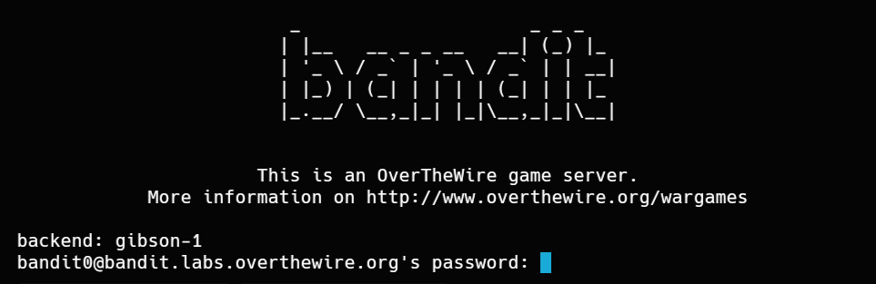

## Bandit Level 0
### Objetivo del Nivel 
El objetivo de este nivel es que inicies sesión en el juego mediante `SSH`. El servidor al que debes conectarte es `bandit.labs.overthewire.org`, en el puerto `2220`. El nombre de usuario es `bandit0` y la contraseña es `bandit0`. Una vez que hayas iniciado sesión, ve a la página del Nivel 1 para descubrir cómo superar el Nivel 1.


### Comandos Utilizados
Secure Shell (`SSH`) es un protocolo de red cifrado que permite conectarte y administrar de forma remota y segura una máquina Linux desde tu propia terminal.

**Sintaxis para conectarse de forma remota**

```bash 
ssh usuario@host -p puerto
```
* `usuario:` Nombre de usuario con el que te autenticas en la maquina remota, en este caso (bandit0)
- `host`: Dirección o dominio del servidor remoto (`bandit.labs.overthewire.org`)
- `-p`: Bandera (flag) que se usa para especificar el numero de puerto.
- `puerto`: Es el canal de comunicación. El puerto 22 es el puerto por defecto de SSH, en este caso bandit usa el puerto 2220. Si se omite el numero de puerto SSH usa el puerto 22.

**Comando para acceder al servidor de Bandit**
```bash 
ssh bandit0@bandit.labs.overthewire.org -p 2220
```
Te pedirá una contraseña, para este nivel la contraseña es `bandit0`


**Cerrar Sesion remota**

```bash 
exit
```
`exit`: Se usa para desconectarse del Servidor.También se puede usar` Ctrl + d`

**Errores comunes al usar SSH**

- `Permission denied, please try again.`: Ocurre cuando ingresas la contraseña incorrecta.

- `Connection timed out`: Ocurre cuando colocas un puerto incorrecto
